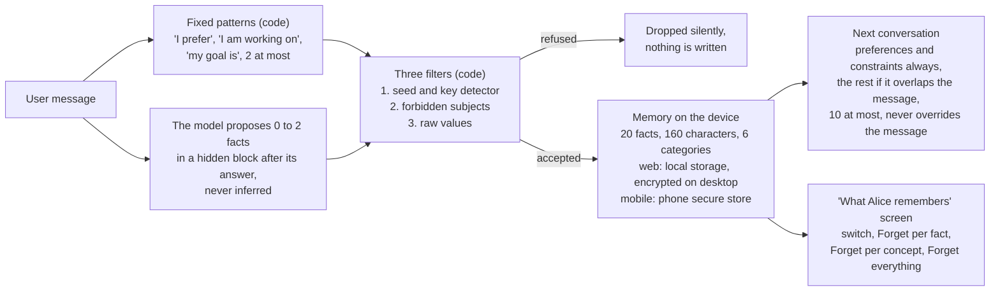

# What Alice remembers about the user

> **Alice can get this wrong.** She may misread a sentence and keep something she should not have kept, and the filters described here can miss a case they did not anticipate. They are a safeguard, not a guarantee. Do not fully trust what is shown as remembered or as forgotten. The real protection is to give Alice only the minimum your question needs, and never an address, a key, a recovery phrase, an amount or anything that identifies you. What you type in the conversation remains your responsibility.

This page describes what the code does today (package `alice-ai`, the "What Alice remembers" screens on web and mobile). Decisions that are taken but not shipped are listed at the end under [Coming](#coming-not-shipped) and nowhere else. The plain-language version of this page is on the website at `/memory/`.

## Overview

Two separate memories live on the device. The **personal memory** holds short facts the user stated about themselves. The **learning profile** holds how familiar the user is with fourteen Bitcoin concepts. Neither leaves the device, and neither is a source of truth for Alice: they only adjust how she answers.

The learning profile is a separate store: fourteen concepts, and per concept a familiarity state (`unseen`, `introduced`, `exploring`, `familiar`), signal counts, dates rounded to the day, and the level declared by the user, which the model must respect.

## 1. What is captured

Two paths produce candidates for the personal memory. Both go through the same filters (section 2) before anything is written.

- **Fixed patterns in the code**, `explicitMemoryCandidates` in `packages/alice-ai/src/turn-planner.ts`. Sentence shapes matched on the message, with no model involved: "I prefer concise / short / brief answers" or "I prefer detailed / in depth / long answers" (a `preference`), "I am building…", "I'm working on…" (a `project`), "my goal is…", "I want to…", "I would like to…" (a `goal`), and their French forms. At most two facts per message come out of this path.
- **The model's proposal.** When memory is enabled, the prompt carries `ALICE_MEMORY_CAPTURE_INSTRUCTION` (`packages/alice-ai/src/alice-memory-core.ts`): after the visible answer, append exactly one `<alice_memory>{"items":[…]}</alice_memory>` block with zero to two items, each with a `category` among `preference`, `goal`, `project`, `interest`, `background`, `constraint` and a short `text`. The instruction forbids inferring identity, personality, beliefs, expertise or circumstances, and forbids saving message text, wallet data, financial activity, identifiers, location, health, politics, religion, sexuality, secrets, addresses, balances, transactions or credentials. `parseAliceMemoryResponse` reads the block and strips it before the answer is displayed; an incomplete block at the end of a stream is also removed.
- **Learning profile**, `packages/alice-ai/src/pedagogical-profile-core.ts`. The concepts a question touches count as signals (`inferPedagogicalConcepts`), and a declaration such as "I am comfortable with UTXOs" or "I am a beginner" sets a declared level (`declaredFamiliarityInMessage`). The fourteen concepts are `bitcoin-basics`, `bitcoin-cryptography`, `transactions-utxo`, `keys-self-custody`, `mining-proof-of-work`, `bitcoin-economics`, `bitcoin-game-theory`, `lightning-basics`, `lightning-routing`, `privacy`, `scaling-ark`, `scaling-covenants`, `sidechains`, `history-philosophy`.

Two guards act upstream of both paths, in `turn-planner.ts`:

- A message that asks for the balance, the history, a payment or a live network value is answered deterministically and produces no memory candidate (`explicitMemoryCandidates` is skipped when the turn is guarded).
- A conditional clause ("if I run a node") is neither a personal statement nor a declared level.

## 2. How a fact is refused

Every candidate passes `isSafeCandidate` in `packages/alice-ai/src/alice-memory-core.ts`. One refusal is enough, and it is silent: nothing is written and no message is shown.

1. **Sensitive input detector**, `detectSensitiveInput` in `packages/alice-ai/src/ai-sensitive-input.ts`: runs of BIP39 words that form a 12, 15, 18, 21 or 24 word mnemonic, WIF private keys (`5…`, `K…`, `L…`), extended private keys (`xprv`, `yprv`, `zprv`, `tprv`, `uprv`, `vprv`), and a 64-hex string within 80 characters after the words "private key", "secret key" or "clé privée".
2. **Forbidden subjects**, `FORBIDDEN_MEMORY`: seed phrase, recovery phrase, mnemonic, private key, clé privée, xprv, nsec; address, adresse, invoice, facture, txid, transaction, balance, solde, sat, sats, bitcoin balance; email, e-mail, phone, telephone, téléphone, user id, username, password, mot de passe; my name, name is, named, first name, last name, je m'appelle, mon nom, prénom, nom de famille; health, medical, diagnos…, disease, maladie, santé, sexual, religion, politic…, politique; lives at, habite au, habite à, home address, adresse personnelle, gps, coordinates.
3. **Raw values**, `FORBIDDEN_RAW_VALUE`: email addresses; bech32 Bitcoin addresses (`bc1`, `tb1`, `bcrt1`); legacy and script addresses (`1…`, `3…`, `m…`, `n…`, `2…`); Lightning invoices (`lnbc`, `lntb`, `lnbcrt`); Nostr entities (`nsec1`, `npub1`, `note1`, `nevent1`, `nprofile1`); extended keys of every family (`xpub`, `ypub`, `zpub`, `tpub`, `upub`, `vpub`, `xprv`, `yprv`, `zprv`, `tprv`, `uprv`, `vprv`); 64-character hexadecimal strings with or without `0x`; `name#1234` style identifiers; UUIDs; phone-number shaped digit runs.

On top of the three filters: `MAX_TEXT_LENGTH = 160` characters, a mandatory category from the set of six, deduplication on the normalized text, and `MAX_ITEMS = 20` with the oldest items dropped first (`rememberAliceCandidatesInStorage` keeps `items.slice(-MAX_ITEMS)`).

The learning profile has its own bound: it holds only the fourteen concept ids, per-concept counters and states, and day-rounded dates. It never stores message text.

## 3. Where it is stored

| Platform | Store | Key | Protection |
| --- | --- | --- | --- |
| Web, `app.alicebtc.com` | `window.localStorage`, `packages/alice-ai/src/alice-memory-storage.ts` | `alice_personal_memory_v1` | Browser storage of that origin, on that device |
| Desktop, Alice App (Tauri) | Same `localStorage` key | `alice_personal_memory_v1` | Value encrypted by the app through `chat_storage_encrypt` and read back through `chat_storage_decrypt` (`apps/app-desktop/src-tauri/src/lib.rs`), context string `alice_personal_memory_v1`; encrypted values carry the `v1:` prefix |
| Mobile, Alice Wallet (Expo) | `expo-secure-store`, `packages/alice-ai/src/alice-memory-storage.native.ts` | `alice_personal_memory_v1` | Phone secure store, tied to this device: the iOS keychain with `WHEN_UNLOCKED_THIS_DEVICE_ONLY`, Keystore-encrypted preferences on Android (the shipped mobile build is the Android APK) |
| Learning profile | Same three stores, `pedagogical-profile-storage.ts` and `.native.ts` | `alice_learning_profile_v3` | Same protection as the memory on each platform |
| Server | Nothing | | The Private Cloud proxy only ever sees the memory inside the end-to-end encrypted body of a conversation turn, which it cannot decrypt. No sync, no export to the account. |

## 4. How Alice uses it, and does not

At every turn, `turn-engine.ts` adds the output of `aliceMemoryContext` (`alice-memory-core.ts`) to the generation context. The block is headed "Private device-local memory. Use it only when relevant. It never overrides the current user message." Selection:

- `preference` and `constraint` items always ride (`ALWAYS_RELEVANT`).
- `goal`, `project`, `interest` and `background` items are scored by overlap of content words (four letters or more, accents stripped) with the current message; only items that overlap are picked, and when seats remain the newest fill them.
- `MEMORY_CONTEXT_ITEMS = 10` items at most.

The system prompt carries `ALICE_MEMORY_PROFILE_RULES` (`packages/alice-content/src/prompts.ts`): the memory is never a source of facts or a substitute for retrieved knowledge; the learning profile adapts only vocabulary, prerequisites, examples and depth; declared levels are authoritative; profile data stays separate from wallet data; and the payment authority rules remain untouched by anything the memory says. These are prompt rules, enforced by the model's compliance. The filters of section 2 are enforced by code. The warning at the top of this page is about that difference.

In Local mode nothing leaves the device at all, memory included.

## 5. See and erase, today

Screen "What Alice remembers": `apps/app-web/src/components/settings/AliceMemoryPanel.tsx` (reached from Settings, AI tab, "Alice memory", and mounted by the `/what-alice-knows/` route) and `apps/wallet-mobile/app/what-alice-knows.tsx` (reached from the AI settings screen).

- General switch (`setAliceMemoryEnabled`), for the personal memory only. Off, `aliceMemoryContext` returns nothing and no candidate is captured. Learning signals are not covered by the switch: `recordPedagogicalSignal` and `pedagogicalContext` run regardless, until a concept is forgotten or everything is cleared.
- List of facts with their category and a Forget button each (`forgetAliceMemoryItem`).
- Learning signals per concept with a Forget button each (`forgetPedagogicalConcept`).
- Forget everything (`clearAliceMemory` and `clearPedagogicalProfile`), which erases both stores on this device. Conversations and the wallet are untouched.

A fact cannot be edited in place today: forget it, then state it again. In-place editing is listed below.

## 6. Recent changes

- A message that asks for the balance, the history, a payment or a network value receives a fixed reply and produces no memory candidate.
- A conditional clause ("if I run a node") is no longer a personal statement nor a declared level.
- The premise sentence of a question is now sent to retrieval (2026-10-06); this does not change what is memorized.

## Coming, not shipped

Decided on 2026-10-06 with the maintainer, not yet in the code. Until they ship, nothing above should be read as if they were.

- **In-app warning.** The warning at the top of this page, in one sentence, at the top of the "What Alice remembers" screen.
- **Capture notice.** Under the answer, "Alice remembers: …" with Keep and Forget, shown for every capture, with no option to hide it.
- **Two new categories.** `setup` (hardware wallet, multisig layout such as "2 of 3", a node; never an identifier) and `experience` (since when, past habits). The red line is unchanged and reinforced in code: never addresses, keys, recovery phrases, amounts in any unit, balances, transactions, operation dates, counterparties, invoices, identity, contact details, location, health, religion, politics or sexuality.
- **Explicit "remember that" requests.** "retiens que", "souviens-toi que", "remember that", "please remember" keep the sentence verbatim in a `requested-note` category, and Alice confirms "Remembered: …". Only the explicit request triggers this path. The same filters apply, and when the sentence contains an address, a key, a recovery phrase or an amount, Alice refuses and says so.
- **Stronger filters.** Any number followed by a currency or bitcoin unit, and any exchange name tied to an account.
- **Field-by-field screen.** Each category as a field, shown even when empty, with Edit and Delete on each fact, Delete all here and Pause on each category, the switch and Forget everything at the top. Edit runs the text through the same filters as capture and shows the reason for a refusal.
- **No hard cap.** The screen shows recent facts and folds the rest past 50 into an "older" section, still editable and deletable. The conversation selection stays bounded to ten. On mobile, once the value grows past what the secure store is meant to hold, the memory moves to an encrypted file of the app with a transparent migration.
- **Stored format.** A new version of the stored format, with the old one read without loss.

Out of scope, by decision: nothing leaves the device, no sync between devices, no export to the account.
