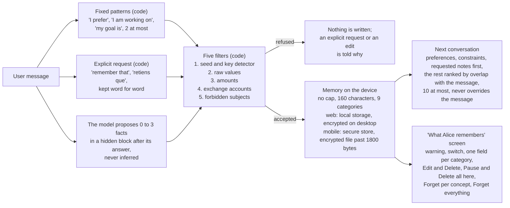

# What Alice remembers about the user

> **Alice can get this wrong.** She may misread a sentence and keep something she should not have kept, and the filters described here can miss a case they did not anticipate. They are a safeguard, not a guarantee. Do not fully trust what is shown as remembered or as forgotten. The real protection is to give Alice only the minimum your question needs, and never an address, a key, a recovery phrase, an amount or anything that identifies you. What you type in the conversation remains your responsibility.

This page describes what the code does today (package `alice-ai`, the "What Alice remembers" screens on web, desktop and mobile), as shipped in Alice App 0.2.2 on the web and on desktop. The Android app, Alice Wallet, is still version 0.2.0: until its next build, the phone runs the previous memory, described in [section 3](#3-where-it-is-stored) and [section 5](#5-see-edit-and-erase). Decisions that are taken but not shipped are listed at the end under [Coming](#coming-not-shipped) and nowhere else. The plain-language version of this page is on the website at `/memory/`.

## Overview

Two separate memories live on the device. The **personal memory** holds short facts the user stated about themselves, in eight categories, and the sentences the user explicitly asked Alice to keep, in a ninth. The **learning profile** holds how familiar the user is with fourteen Bitcoin concepts. Neither is stored off the device, and neither is a source of truth for Alice: they only adjust how she answers.

The learning profile is a separate store: fourteen concepts, and per concept a familiarity state (`unseen`, `introduced`, `exploring`, `familiar`), signal counts, dates rounded to the day, and the level declared by the user, which the model must respect.

## 1. What is captured

Three paths produce candidates for the personal memory. All of them go through the same filters (section 2) before anything is written. The categories, in the display order of `ALICE_MEMORY_CATEGORIES` (`packages/alice-ai/src/alice-memory-core.ts`), are `preference`, `setup`, `experience`, `goal`, `project`, `interest`, `constraint`, `background` and `requested-note`.

- **Fixed patterns in the code**, `explicitMemoryCandidates` in `packages/alice-ai/src/turn-planner.ts`. Sentence shapes matched on the message, with no model involved: "I prefer concise / short / brief answers" or "I prefer detailed / in depth / long answers" (a `preference`), "I am building…", "I'm working on…" (a `project`), "my goal is…", "I want to…", "I would like to…" (a `goal`), and their French forms. At most two facts per message come out of this path. There is no fixed pattern for `setup` or `experience` yet.
- **Explicit request to remember**, `requestedNoteInMessage` in `turn-planner.ts`. "retiens que", "retenez que", "souviens-toi que", "rappelle-toi que", "retiens ceci :", "peux-tu retenir…", "remember that", "remember this:", "please remember", "can you remember…", optionally after "Alice,", "ok" or "please". The first sentence after the trigger is kept as written, minus quotes and final punctuation, in the `requested-note` category. It must contain a first-person word (I, my, me, je, mon, ma, mes, j', m'), and a question inside it cancels the path: "Remember that the halving happens every four years" stays an ordinary turn. "Note that" and "keep in mind that" are not triggers. When the request is the whole message, the turn is answered without retrieval or model (`turn-engine.ts`): a refused sentence gets `aliceMemoryRefusalMessage`, which names what the filter caught; an accepted one gets `directRequestedNoteResponse`, which says "Noted: …" ("Retenu : …") only when the write succeeded and the note is in the store, and otherwise says that memory is off, that Requested notes are paused, or that the save failed. When the request comes with a question, the note rides along as an explicit candidate, and a refused note is dropped without a message. A learning declaration inside the note ("souviens-toi que je débute avec Lightning") still updates the learning profile.
- **The model's proposal.** When memory is enabled, the prompt carries `ALICE_MEMORY_CAPTURE_INSTRUCTION` (`alice-memory-core.ts`): after the visible answer, append exactly one `<alice_memory>{"items":[…]}</alice_memory>` block with zero to three items, each with a `category` among the eight other than `requested-note` and a short `text`, with one kept and one refused example for `setup` and for `experience`. The instruction forbids inferring identity, personality, beliefs, expertise or circumstances, and forbids saving message text, wallet data, financial activity, amounts in any unit, exchange or platform accounts, direct identifiers, location, health, politics, religion, sexuality, secrets, addresses, balances, transactions or credentials; what the user knows belongs to the learning profile, not here. `parseAliceMemoryResponse` reads the block, drops any `requested-note` item, keeps at most `MAX_CANDIDATES_PER_TURN = 3`, and strips the block before the answer is displayed; an incomplete block at the end of a stream is also removed.
- **Learning profile**, `packages/alice-ai/src/pedagogical-profile-core.ts`. The concepts a question touches count as signals (`inferPedagogicalConcepts`), and a declaration such as "I am comfortable with UTXOs" or "I am a beginner" sets a declared level (`declaredFamiliarityInMessage`). In Learn (`apps/app-web/src/components/LearnPanel.tsx`), reading a new chapter counts as a signal (`recordCourseStudy`), and finishing a course sets the level to `exploring` for a beginner course and `familiar` above, never lower than a level already declared (`recordCourseCompletion`). The fourteen concepts are `bitcoin-basics`, `bitcoin-cryptography`, `transactions-utxo`, `keys-self-custody`, `mining-proof-of-work`, `bitcoin-economics`, `bitcoin-game-theory`, `lightning-basics`, `lightning-routing`, `privacy`, `scaling-ark`, `scaling-covenants`, `sidechains`, `history-philosophy`.

Two guards act upstream of the patterns and the model, in `turn-planner.ts`:

- A message that asks for the balance, the history, a payment or a live network value is answered deterministically and produces no memory candidate (`explicitMemoryCandidates` is skipped when the turn is guarded, and the model is not called).
- A conditional clause ("if I run a node") is neither a personal statement nor a declared level.

## 2. How a fact is refused

Every candidate passes `aliceMemoryRefusalReason` in `alice-memory-core.ts`: through `isSafeCandidate` on capture and each time the store is read, and directly when a fact is edited. One refusal is enough and nothing is written. The checks run in this order, and the first match gives the reason (`AliceMemoryRefusalReason`): length (`too-short` under `MIN_TEXT_LENGTH = 3`, `too-long` over `MAX_TEXT_LENGTH = 160` characters, after whitespace is normalized), then five filters.

1. **Sensitive input detector** (`secret`), `detectSensitiveInput` in `packages/alice-ai/src/ai-sensitive-input.ts`: twelve or more consecutive words from the English BIP39 list (checked as runs of 12, 15, 18, 21 or 24 words, checksum not required), WIF private keys (`5…`, `K…`, `L…`), extended private keys (`xprv`, `yprv`, `zprv`, `tprv`, `uprv`, `vprv`), and a 64-hex string within 80 characters after the words "private key", "secret key" or "clé privée".
2. **Raw values**, `FORBIDDEN_RAW_VALUE`: email addresses (`identity`); bech32 Bitcoin addresses (`bc1`, `tb1`, `bcrt1`), legacy and script addresses (`1…`, `3…`, `m…`, `n…`, `2…`), Lightning invoices (`lnbc`, `lntb`, `lnbcrt`) and Nostr entities (`nsec1`, `npub1`, `note1`, `nevent1`, `nprofile1`) (`address`); extended keys of every family (`xpub`, `ypub`, `zpub`, `tpub`, `upub`, `vpub`, `xprv`, `yprv`, `zprv`, `tprv`, `uprv`, `vprv`) and 64-character hexadecimal strings with or without `0x` (`secret`); `name#1234` style identifiers, UUIDs and phone-number shaped digit runs (`identity`).
3. **Amounts** (`amount`), `AMOUNT_PATTERNS`: a number (digits, with space, dot, comma or apostrophe separators) or a number word in English or French ("two", "twenty", "half", "a few", "deux", "mille", "quelques"…), optionally followed by `k` or `m`, then a unit: `btc`, `xbt`, `bitcoin(s)`, `sat(s)`, `satoshi(s)`, `msat(s)`, `€`, `eur`, `euro(s)`, `$`, `usd`, `dollar(s)`, `£`, `gbp`, `pound(s)`, `chf`, `franc(s)`, `¥`, `yen`, `jpy`, `cad`, `aud`, `cny`, `yuan`, unless the unit is followed by a counted noun ("two bitcoin wallets", "five bitcoin books"); a currency symbol or code (`€`, `$`, `£`, `¥`, `eur`, `usd`, `gbp`, `chf`, `btc`, `xbt`) followed by a number; "half a bitcoin", "un demi-bitcoin". A bare number stays allowed: "since 2021", "2-of-3".
4. **Exchange accounts** (`exchange`), `isExchangeAccount`. Refused on sight: Binance, Kraken, Coinbase, Bitstamp, Bitfinex, Bitpanda, Bitvavo, Paymium, OKX, Bybit, KuCoin, Bitget, Bittrex, Poloniex, Huobi, HTX, MEXC, Gate.io, CEX.IO, eToro, Robinhood, Crypto.com, Upbit, Bithumb. Refused only with an account word in the same text (compte, account, wallet, portefeuille, kyc, exchange, plateforme, platform, login, identifiant, verified, vérifié): Gemini, Strike, River, Swan, Relai, Revolut, N26, PayPal, Cash App, Bull Bitcoin, Ledger Live.
5. **Forbidden subjects**, `FORBIDDEN_MEMORY`: seed phrase, recovery phrase, mnemonic, private key, cle privee, clé privée, phrase de recuperation, phrase de récupération, phrase secrete, phrase secrète, xprv, nsec (`secret`); address, adresse, invoice, facture (`address`); txid, transaction, balance, solde, sat, sats, bitcoin balance (`activity`); email, e-mail, phone number, numero de telephone, numéro de téléphone, user id, username, password, mot de passe, my name, name is, named, first name, last name, je m'appelle, mon nom, prenom, prénom, nom de famille (`identity`); health, medical, diagnos, disease, maladie, sante, santé, sexual, religion, politic, politique (`sensitive`); lives at, habite au, habite à, home address, adresse personnelle, gps, coordinates (`location`). "Phone" alone is allowed, so "only has a phone, no computer" is a valid constraint. Each term is matched as a whole word: `politic` and `diagnos` do not catch "politics" or "diagnosis", "sexual" does not catch "sexuality", and a term ending in an accented letter (`santé`, `habite à`, and `vérifié` among the account words of filter 4) never matches, because the regular expression's word boundary treats accented letters as non-word characters. This is one of the cases the warning at the top is about.

On top of the filters: a mandatory category from the set of nine, deduplication on the normalized text (`normalizedKey`, which also folds "prefers…" and "working on…" variants), and no new fact in a paused category. There is no cap on the store: nothing is dropped to make room (`writeAliceCandidatesToStorage` keeps every item). Each write adds at most `MAX_CANDIDATES_PER_TURN = 3` facts.

`aliceMemoryRefusalMessage` turns a reason into one sentence, in English or French: "Alice cannot keep this sentence: it contains an amount. Addresses, keys, recovery phrases, amounts and identity details are never kept, even on request, because a filter can be wrong and none of it helps her answer better." It is shown in the chat for a standalone "remember that" request and under the edit field on the screen. Every other refusal is silent.

The learning profile has its own bound: it holds only the fourteen concept ids, per-concept counters and states, and day-rounded dates. It never stores message text.

## 3. Where it is stored

| Platform | Store | Key | Protection |
| --- | --- | --- | --- |
| Web, `app.alicebtc.com` | `window.localStorage`, `packages/alice-ai/src/alice-memory-storage.ts` | `alice_personal_memory_v1` | Browser storage of that origin, on that device |
| Desktop, Alice App 0.2.2 (Tauri) | Same `localStorage` key | `alice_personal_memory_v1` | Value encrypted by the app through `chat_storage_encrypt` and read back through `chat_storage_decrypt` (`apps/app-desktop/src-tauri/src/lib.rs`): AES-256-GCM with the context string `alice_personal_memory_v1`, key held in the operating-system keychain; encrypted values carry the `v1:` prefix |
| Mobile, Alice Wallet (Expo), current code | `expo-secure-store`, `packages/alice-ai/src/alice-memory-storage.native.ts` and `alice-memory-tiered-storage.ts` | `alice_personal_memory_v1`, file key `alice_personal_memory_file_key_v1` | Phone secure store, tied to this device: the iOS keychain with `WHEN_UNLOCKED_THIS_DEVICE_ONLY`, Keystore-encrypted preferences on Android. Past `ALICE_MEMORY_KEYCHAIN_LIMIT_BYTES = 1800` bytes, the memory moves to `alice-memory/memory.enc` in the app's documents directory, encrypted with AES-GCM under a random 32-byte key kept in the secure store, and the secure-store value becomes the marker `file:v1`; it moves back when it shrinks |
| Mobile, Alice Wallet 0.2.0 (the Android APK in testers' hands) | `expo-secure-store` only | `alice_personal_memory_v1` | Same secure store, no file. The 0.2.0 memory has six categories (`preference`, `goal`, `project`, `interest`, `background`, `constraint`), keeps at most 20 facts with the oldest dropped first, runs the earlier filters without the amount and exchange rules, and has no requested notes, no edit and no pause. The next Android build reads that store without loss (`parseMemory` accepts format 1) |
| Learning profile | Same stores, `pedagogical-profile-storage.ts` and `.native.ts` | `alice_learning_profile_v3` | Same protection as the memory on each platform, without the file tier on mobile |
| Server | Nothing | | No sync, no export to the account. See below for what travels with a Private Cloud message |

The stored value is format `version: 2` (`enabled`, `items`, `pausedCategories`); format 1 is still read, and a stored item that no longer passes the filters is skipped on read and leaves the store at the next write.

When the user chats through Private Cloud, the memory block of section 4 (ten facts at most) and the learning profile hints travel inside the encrypted body of the turn, with the message (`turn-engine.ts`, the comment above the `memoryContext` call). The proxy relays that body without being able to decrypt it. Alice verifies the enclave hardware before every message, but cannot yet verify which software runs inside it: the reachable assurance level is "attested-unpinned", explained on the website at `/trust/`. In Local mode nothing leaves the device at all, memory included. With a custom server the user configured, the same context goes to that server with the message.

## 4. How Alice uses it, and does not

At every turn, `turn-engine.ts` adds the output of `aliceMemoryContext` (`alice-memory-core.ts`) to the generation context, on every backend. The block is headed "Private device-local memory. Use it only when relevant. It never overrides the current user message." Selection:

- `preference`, `constraint` and `requested-note` items come first (`ALWAYS_RELEVANT`), newest first.
- `setup`, `experience`, `goal`, `project`, `interest` and `background` items are scored by overlap of content words (four letters or more, accents stripped) with the current message; the items that overlap come next, best score first, and any seats left go to the newest of the rest.
- `MEMORY_CONTEXT_ITEMS = 10` items at most, however many are stored.

The system prompt carries `ALICE_MEMORY_PROFILE_RULES` (`packages/alice-content/src/prompts.ts`): the personal memory may hold only short facts the user stated (the categories above, plus notes asked for in so many words) and never raw message text, financial activity, amounts, exchange accounts, identifiers, precise location, health, politics, religion, sexuality, wallet data or credentials; the learning profile adapts only vocabulary, prerequisites, examples and depth, and is never a source of facts or a substitute for retrieved knowledge; declared levels are authoritative; profile data stays separate from wallet data. `ALICE_PAYMENT_AUTHORITY_RULES`, in the same prompt, keep the wallet code as the only authority for payment details and outcomes. These are prompt rules, enforced by the model's compliance. The filters of section 2 are enforced by code. The warning at the top of this page is about that difference.

## 5. See, edit and erase

Screen "What Alice remembers": `apps/app-web/src/components/settings/AliceMemoryPanel.tsx` (reached from Settings, AI tab, "Alice memory", and mounted by the `/what-alice-knows/` route) and `apps/wallet-mobile/app/what-alice-knows.tsx` (reached from the AI settings screen). From top to bottom:

- The warning `ALICE_MEMORY_WARNING`: "Alice can get this wrong: these filters are a safeguard, not a guarantee. Give her the minimum, never an address, a key, a recovery phrase or an amount."
- General switch (`setAliceMemoryEnabled`), for the personal memory only. Off, `aliceMemoryContext` returns nothing, the capture instruction is not sent, no candidate is written, and a standalone "remember that" request is answered that memory is off. Learning signals are not covered by the switch: `recordPedagogicalSignal` and `pedagogicalContext` run regardless, until a concept is forgotten or everything is cleared.
- One field per category, shown even when empty, with Pause or Resume (`setAliceMemoryCategoryPaused`: capture into that category stops, what it holds stays) and Delete all here (`clearAliceMemoryCategory`, after an inline confirmation that counts the older facts too).
- Each fact with Edit (`editAliceMemoryItem`: the new text goes through `aliceMemoryRefusalReason`, a refusal is shown under the field and nothing changes) and Delete (`forgetAliceMemoryItem`).
- Past the `ALICE_MEMORY_RECENT_LIMIT = 50` most recent facts, a folded "older facts" section with the same Edit and Delete.
- Learning signals per concept with a Forget button each (`forgetPedagogicalConcept`).
- Forget everything (`clearAliceMemory` and `clearPedagogicalProfile`), after an inline confirmation, which erases both stores on this device, the encrypted file and its key included on mobile. Conversations and the wallet are untouched.

Alice Wallet 0.2.0 on Android shows the previous screen: the switch, the list of facts with their category and a Forget button each, the learning signals with Forget, and Forget everything. A fact cannot be edited there: forget it, then state it again. The screen above reaches the phone with the next Android build.

## 6. Recent changes

- 0.2.2: Setup, Experience and Requested notes categories, requested notes riding with preferences and constraints; explicit "remember that" requests; amount and exchange-account filters; refusal reasons shown in the chat and on the screen; no cap on the store, with the older section past 50; field screen with Edit, Pause and Delete all here; the warning at the top of the screen; up to three model proposals per answer instead of two; storage format 2, format 1 read without loss; on mobile, the encrypted file past 1800 bytes (in the code, not yet in an Android build).
- A message that asks for the balance, the history, a payment or a network value receives a fixed reply and produces no memory candidate.
- A conditional clause ("if I run a node") is no longer a personal statement nor a declared level.
- The premise sentence of a question is now sent to retrieval (2026-10-06); this does not change what is memorized.

## Coming, not shipped

Decided on 2026-10-06 with the maintainer, not yet in the code or not yet in a build. Until they ship, nothing above should be read as if they were.

- **Capture notice.** Under the answer, "Alice remembers: …" with Keep and Forget, shown for every capture, with no option to hide it. Today a capture by the patterns or the model is visible only on the "What Alice remembers" screen; only a standalone "remember that" request gets an answer.
- **Fixed patterns for setup and experience.** "I have a multisig", "I use a Ledger", "I run a node" and their French forms. Today these facts reach the memory only through the model's proposal or an explicit request.
- **The new memory on the phone.** Everything above that differs from Alice Wallet 0.2.0 (section 3) reaches Android with its next build.

Out of scope, by decision: no copy off the device, no sync between devices, no export to the account.
